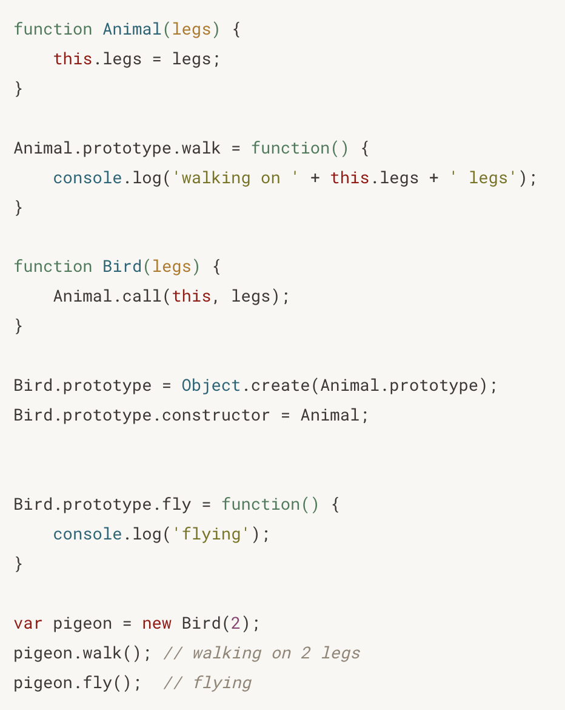
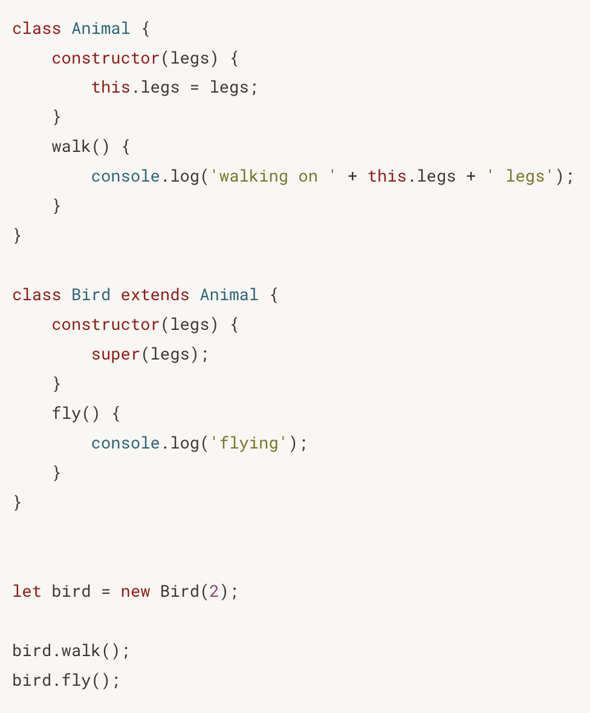

## Promise/Async/Await

- Eager giống như construtor của class, chạy mỗi khi khởi tạo object
- Lazy giống như define một function mà không chạy.

1. <b>Khởi tạo promise</b>:

- Cách 1:

  ```javascript
  const p1 = new Promise((resolve, reject) => {
    // executor này có lẻ là đặt trong constructor của Promise
    // ... complex logic
    resolve("value");
  });
  ```

- Cách 2:

  ```javascript
  const p2 = Promise.reject("error gi do...");
  ```

- Cách 3: chuyển eager thành lazy

  ```javascript
  const p3 = function (miliSecond) {
    return new Promise((resolve, reject) => {
      setTimeout(() => {
        resolve("data sau 1 khoang thoi gian");
      }, miliSecond);
    });
  };
  ```

- Cách 4: Async function
  ```javascript
  const p4 = async () => {
    // return Promise.resolve('data')
    return "data";
  };
  ```

2. <b> Consume data </b>

   ```javascript
   p2.catch((error) => {
     console.log(error);
   });

   const newP = p3()
     .then((data) => {
       console.log(data);
       // Quá trình consume (then(...)) luôn tạo ra 1 promise nếu không return trong then có nghĩa là return undefined.
       // return data + 1 <=> return Promise.resolve(data + 1)
       return data + 1;
     })
     .then((x) => {
       console.log("xxxxx", x);
       // Muốn cho consume tiếp theo nhảy vào catch thì:
       return Promise.reject(new Error("error"));
       // throw new Error('error')
     })
     .catch((error) => {
       console.log(error);
       // Không return có nghĩa là return undefined <=> return Promise.resolve(undefined)
     })
     .then((x) => {
       console.log(x);
       // Cứ thế vô tận và newP là cái return cuối cùng của promise chain.
     });

   // Chỉ dùng await trong async function. Mà async function thì return về 1 promise
   // await 1 promise sẽ giống với việc .then và gán value của promise trước đó cho quá trình await
   // Sử dụng try catch để xử lý resolve reject với async function
   function normal() {
     return 1;
   }
   const aFn = async () => {
     try {
       console.log("async function");
       const data = await normal();
       console.log(data);
     } catch (error) {
       // ... xử lý lỗi
     }
     return 1;
   };

   // Promise.all([p1,p2,p3]).then(data => console.log(data)) data là []

   // Các thứ tự chạy: callstack => microtask queue (callback của then)=> task queue (callback cua setTimeout,...)
   // Minh họa https://www.jsv9000.app/
   ```

## Object and Class

- Hình tròn đại diện cho function, hình vuông đại diện cho Object. Ref: https://www.javascripttutorial.net/javascript-prototype/
  > `obj.constructor` sẽ tìm các properties của nó trước sau đó tìm ở `obj.__proto__`

<p align="center" width=100%>
    
</p>

- Kế thừa trong javascript bằng prototype:

  > `let teacher = Object.create(person)`

  > `Object.create(object, propertiesObject)` // lấy toàn bộ properties methods của object cho `prototype` object mới

<p align="center" width=100%>
    
</p>

- Con trỏ `this` sẽ references tới object mà hiện tại đang gọi function. Trick lỏ ví dụ x.y thì x là this.

  - Function invocation: `this` sẽ ref tới `global object` với `non-strict` và `undefined` với `strict-mode`
  - Method invocation: `obj.method()`, `this` sẽ trỏ tới `obj` đang gọi method đó. Nếu gán method đó bằng biến khác thì khi gọi biến đó `this` sẽ ref tới `global object`. Bất kể là có gán cho obj khác đi nữa. Dùng `call`, `bind`, `apply`.
  - Contructor invocation: sử dụng từ khóa `new` với một function (không phải `arrow function`) sẽ tạo `this = {}` trong function đó
  - Indirect invocation: sử dụng `call`, `bind`, `apply`.
    - `call(thisArg, arg1, arg2, ...)`: gọi hàm và truyền object như là `this`
    - `bind(thisArg, [arg1,arg2,...])`: giống call
    - `apply(thisArg, arg1, arg2, ...)`: trả về 1 hàm mới.

- Object Property types:

  - Data properties

    ```javascript
    "use strict";
    let obj = {};

    Object.defineProperty(obj, "age", {
      configurable: false, // có thể được redefined hay delete không. Default true
      enumerable: true, // Có thể `for in` key này không. Default true
      writable: true, // value có thể được change không. Default true
      value: "5", // value. Default undefined
    });
    delete obj.age; // Có lỗi do `configurableset` là false
    ```

  - Acessor properties

    ```javascript
    let obj = {};

    Object.defineProperty(obj, "fullName", {
      configurable: false, // có thể được redefined hay delete không. Default true
      enumerable: true, // Có thể `for in` key này không. Default true
      get: function () {
        // khi read value thì get function tự động gọi. Default undefined
        return this.firstName + " " + this.lastName;
      },
      set: function (value) {
        // Khi assign value thì set function tự động gọi.
        if (value && typeof value === "string") {
          this.firstName = value;
        }
        throw "Invalid name";
      },
    });
    ```

  - `Object.getOwnPropertyDescriptor()`: descriptor là Data + Accessor
  - `For...in` loop được cả prototype chain.
  - `obj.hasOwnProperty()` return boolean. Xác định property đó có phải của riêng obj đó không.
  - `Factory function` là function return 1 obj.
  - `obj ?. property` return về undefined thay vì quăng lỗi. Có thể dùng với function để kiểm tra func đó có là undefined hay null.
  - `?? [expression]` nếu giá trị trước đó là null hoặc undefined.

- Class ES6

   ====>
  

  - Class KHÔNG `hoisted`
  - `new class {}`: class expression. Dùng để tạo 1 singleton object
  - `[expression]`: có thể dùng để làm tên key
  - `static funcProperty(){}` hoặc `this.constructor.funcProperty()` để call static function. Static function là function không thuộc về obj mà là của class.
  - Dùng `#` trước filed để đánh dấu private(ES2022). Nếu trình duyệt không hỗ trợ hãy dùng `let` hoặc `var`

- Closure: lưu trữ biến của outer function. Có thể kết hợp với IIFE để gói setTimeout
